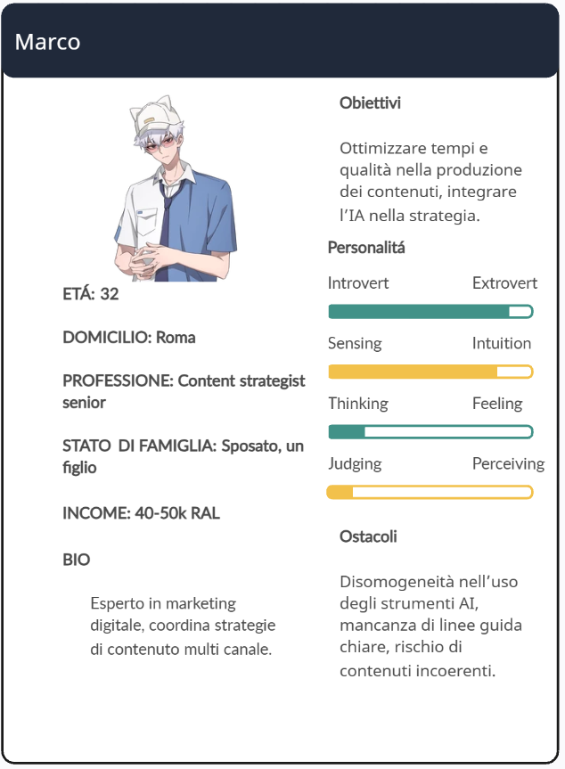
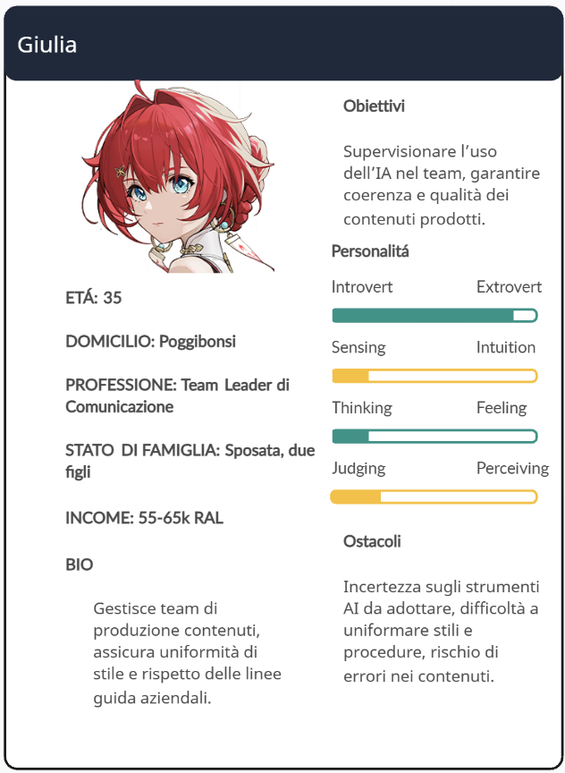
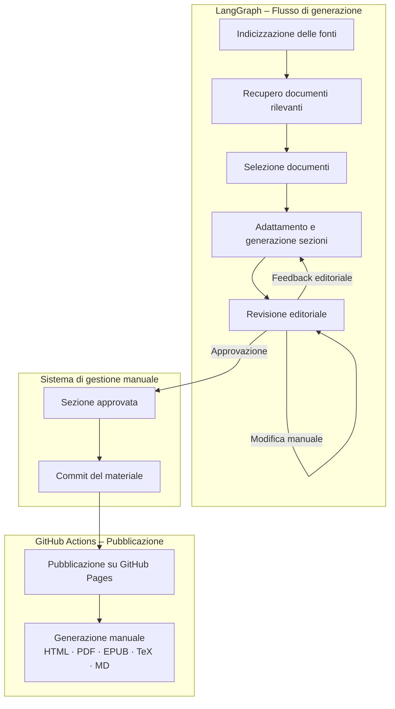
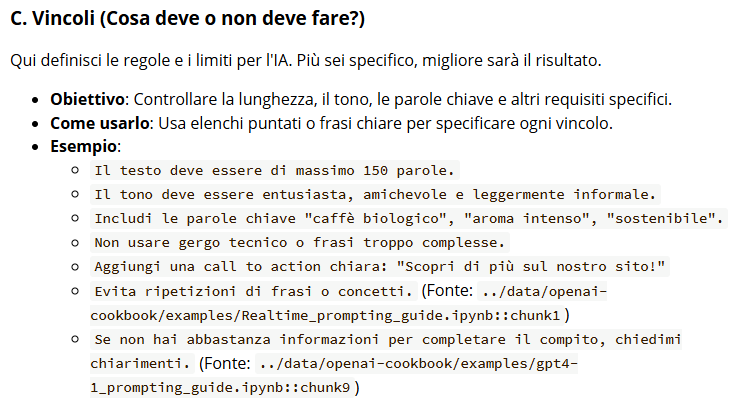
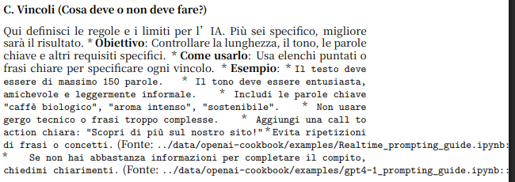
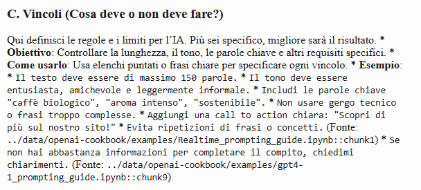
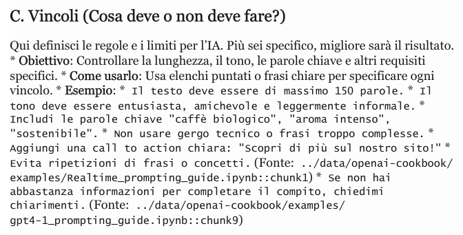

# Sous-Chef AI

Sistema automatizzato per la ricerca, la costruzione, la revisione ed il rilascio di manuali d'uso.

> Sous-Chef AI, dove lo Chef sei tu!

## Introduzione

Il progetto ha due soggetti principali:

- Il **sistema**, ovvero il generatore di manuali
- Il **manuale**, ovvero l'output del sistema

Il **sistema** mira a semplificare il processo di realizzazione di manuali fornendo all'utenza:

- *Ricerca automatizzata* all'interno del documentale
- *Traduzione e adattamento* del contenuto seguendo le indicazioni dell'utente
- *Processo di revisione c*he permette la modifica del contenuto o la sua completa riscrittura, specificando un prompt aggiuntivo
- *Pubblicazione automatica* su [GitHubPages](https://roccobalocco.github.io/edu_digital/) di tutti i file legati al manuale
- *Creazione del manuale*, composto da più sezioni generate e revisionate singolarmente, in vari formati

Il **manuale**, tramite linguaggio non tecnico e coerente con il contesto aziendale, mira a spiegare e comprendere:

- *Come utilizzare l'IA* all'interno dell'azienda
- *Come adattare istruzioni operative* ai diversi casi d'uso
- *Esempi pratici* contestualizzati
- *Best practices e limiti* dell'IA

## Ideazione 

### Tema

Il **sistema** è stato progettato per essere quanto più generale possibile, per questo le tematiche che ricerca sono elencate alla voce `TOPIC_SPECS`. L'utenza può modellare le tematiche, utilizzando il seguente schema:

```json
"topic_title": {
    "title": "Title to include",
    "query": "Query for LLM",
    "deliverable_sections": [
        "Section1",
        "Section2",
        "Example1",
        "Example2",
        "Pros/Cons",
    ]
}
```

Anche il processo di selezione dei documenti particolarmente rilevanti è personalizzabile tramite la voce `TOPIC_SELECTOR_SYSTEM`, la quale rappresenta il prompt di sistema utilizzato selezionare i documenti migliori mediante FAISS.

I temi principali su cui il l'**utente utilizzatore** si concentra diventano quindi:

- *Una efficace scrittura dei prompt* , sia in fase di estrazione che di selezione
- *Il controllo e la revisione dei contenuti generati*, che consente un ulteriore fine tuning mediante prompt aggiuntivi

Mentre il **sistema** concentra l'attenzione su tre aspetti principali:

- *Automazione della produzione dei contenuti*, che velocizza la creazione del manuale e riduce il carico cognitivo dell’utente nella fase di ricerca.
- *Revisione umana,* necessaria per assicurare accuratezza, coerenza e aderenza alle specifiche editoriali.
- *Adattamento dei contenuti*, che consente di personalizzare il manuale in base ai feedback e alle esigenze specifiche di ciascun argomento.

La generazione dei contenuti *richiede un intervento attivo da parte dell'utenza* per adattare i temi alle specifiche necessità del manuale. Ogni sezione deve essere sottoposta ad una revisione rigida e rigorosa, che garantisce la coerenza e la qualità dei contenuti.

L'**utente** può dunque concentrarsi minormente sulla ricerca del contenuto, dedicando più tempo alla revisione e alle specifiche richieste editoriali. 

Il **manuale** invece si concentra su contenuti concreti e fruibili, pensati per guidare i destinatari nell’uso dell’IA in contesti reali. 

I temi principali che questo ultimo affronta sono:

- *Introduzione all’uso dell’IA in contesti lavorativi*, con un inquadramento pratico del ruolo dell’intelligenza artificiale nelle attività quotidiane di copywriter e content strategist, evidenziandone potenzialità, limiti operativi e necessità di supervisione umana
- *Istruzioni operative per casi d’uso specifici*, con sezioni dedicate alla costruzione e all’utilizzo di prompt efficaci per attività quali:
  - <u>Text generation</u>, per la creazione di contenuti testuali destinati a post, newsletter o articoli
  - <u>Language detection</u>, per l'identificazione automatica della lingua dei contenuti
  - <u>Cross-tabular analysis</u>, per l'analisi di tabelle e dati testuali finalizzata ad individuare pattern, anomalie e insight
- *Esempi pratici contestualizzati*, selezionati dal repository OpenAI Cookbook e adattati a scenari realistici di agenzia e azienda
- *Best practices e limiti d’uso*, con indicazioni per evitare errori comuni nell’utilizzo degli LLM, migliorare i prompt, verificare gli output e integrare i risultati

In sintesi, mentre il **sistema** si concentra sull’automazione, la selezione e la generazione dei contenuti, il **manuale** offre una guida pratica e contestualizzata che consente all’utente di applicare efficacemente l’IA, mantenendo il controllo creativo e strategico sui contenuti prodotti.

### Destinatari

**Sous-Chef AI** ha lo scopo di supportare il creatore del manuale, semplificando e automatizzando gran parte del flusso editoriale. L'utente può quindi indicizzare, selezionare, adattare e revisionare contenuti a partire dall'OpenAI Cookbook concentrandosi sul controllo qualitativo.

In questo caso il **manuale** é pensato per copywriter e content strategist all'interno di una agenzia di comunicazione digitale. Esso fornisce linee guida pratiche, esempi contestualizzati e buone pratiche nell'uso dell'IA generativa, utilizzando un linguaggio accessibile e colloquiale.

#### Personas


**Scenario d'uso**: deve preparare un calendario editoriale e utilizza il manuale per capire come generare contenuti coerenti e adatti al tono aziendale.



**Scenario d'uso**: deve identificare delle best practices per generare testi coerenti e personalizzati, consultando il manuale per selezionare/creare prompt efficaci e comprendere i limiti degli strumenti AI.



**Scenario d'uso**:  usa il manuale per definire standard condivisi, monitorare le pratiche del team e introdurre nuovi strumenti in modo controllato.

### Requisiti di accettazione

Per raggiungere efficacemente i rispettivi destinatari, il **manuale** e il **sistema**, devono soddisfare una serie di richieste, le quali spaziano su diverse aree.

#### Requisiti funzionali

- *Completezza dei contenuti*, il manuale deve includere istruzioni operative, esempi e linee guida sui limiti d'uso, coprendo almeno i casi d'uso selezionati
- *Chiarezza e comprensibilità*, il linguaggio deve essere fruibile da personale non tecnico e deve rimanere coerente con il contesto aziendale
- *Modularità*, ogni sezione deve risultare indipendente e integrabile senza compromettere la coerenza complessiva
- *Validazione umana*, tutte le sezioni devono passare attraverso un processo di revisione editoriale, atto a garantire accuratezza, coerenza e aderenza alle specifiche
- *Per utilizzare mdBook* è richiesto
  - un file `book.toml` dove definire metadati e configurazioni essenziali (eg: directory di output) 
  - un file `SUMMARY.md` dove definire la struttura e la navigazione del contenuto

#### Modelli di fruizione

- *Non lineare e modulare*, i destinatari possono accedere direttamente alle sezioni di cui hanno bisogno, senza dover leggere l’intero manuale
- *Accesso multicanale*, il manuale è disponibile in diversi formati digitali, i quali supportano dispositivi e contesti differenti

#### Aspetti innovazione

- *Human in the loop*, combinazione di generazione automatica con revisione umana per massimizzare efficienza e qualità
- *Personalizzazione*, possibilità, per l'utenza del sistema, di adattare prompt e sezioni ai casi d'uso specifici, creando manuali su misura
- *Automazione del flusso editoriale*, gestione automatica di indicizzazione, selezione e pubblicazione dei contenuti, riducendo in questo modo il carico operativo
- *Flessibilità nei canali di distribuzione*, generazione di output multi formato compatibili con web, intranet, stampa e multi dispositivo, semplificandone la diffusione 

### Canali di distribuzione

#### Canali principali:

| Canale                     | Descrizione                                                  | Formati                    | Note                                                         |
| -------------------------- | ------------------------------------------------------------ | -------------------------- | ------------------------------------------------------------ |
| **Web/Intranet**           | Manuale accessibile via intranet, portale aziendale o link pubblico | HTML, PDF, md (per mdBook) | Navigazione modulare con link interni e indici interattivi, ricerca integrata (mdBook) |
| **Social**                 | Sintesi o estratti mirati per formazione rapida              | PDF, snippet               | Contenuti ridotti per fruizione veloce, non completo         |
| **Repository/Marketplace** | Condivisione con altri team o agenzie                        | Markdown, TeX              | Versione “template” riutilizzabile per progetti futuri       |

#### Formati:

Il **manuale** risulta disponibile nei seguenti formati per garantire massima flessibilità:

- **[Markdown](https://github.com/roccobalocco/edu_digital/releases/download/docs-20260110175016/manuale_completo.md)**: formato sorgente, sia via moduli sia monolitico, facilmente aggiornabile e riutilizzabile.
- **[HTML](https://github.com/roccobalocco/edu_digital/releases/download/docs-20260110175016/manuale_completo.html) / [mdBook](https://roccobalocco.github.io/edu_digital/)**: fruizione online con navigazione interattiva.
- **[PDF](https://github.com/roccobalocco/edu_digital/releases/download/docs-20260110175016/manuale_completo.pdf)**: stampa e distribuzione offline, con layout coerente e professionale.
- **[ePub](https://github.com/roccobalocco/edu_digital/releases/download/docs-20260110175016/manuale_completo.epub)**: lettura su dispositivi mobili e reader digitali.
- **[Tex / LaTeX](https://github.com/roccobalocco/edu_digital/releases/download/docs-20260110175016/manuale_completo.tex)**: generazione di versioni professionali tipograficamente accurate.

#### Identità visuale

Il **manuale** si concentra sulla leggibilità e sulla facilità di gestione nel tempo. Il formato Markdown garantisce una base solida e coerente per la formattazione, che può poi essere adattata liberamente dall’utente.

La responsabilità di definire l’identità visiva è lasciata agli utilizzatori del **sistema**. In futuro potrebbe essere possibile esportare i contenuti applicando stili, template, layout e altre personalizzazioni anche grazie a Pandoc.

#### Tradizione vs Innovazione

Il **manuale** mantiene coerenza con modelli consolidati di documentazione digitale (ad esempio guide operative, manuali tecnici in md/pdf/html). Allo stesso tempo il **sistema** introduce elementi innovativi, come workflow automatizzati, human-in-the-loop e personalizzazione dei contenuti, per offrire una fruizione dinamica.

## Processo di Produzione

Il processo di produzione del **manuale** combina l’acquisizione dei contenuti con la loro gestione, garantendo coerenza, tracciabilità e aggiornabilità. 

Il **sistema** è progettato per utilizzare fonti in formato Jupyter Notebook (`.ipynb`). Per cambiare documentale è necessario modificare il percorso della variabile di ambiente `COOKBOOK_PATH`. In base ai requisiti progettuali, per questo manuale il percorso è impostato sul repository OpenAI Cookbook.

Le fonti attraversano tre fasi principali di trasformazione:

1. Inizialmente sono *file* in formato `.ipynb`
2. Successivamente ne vengono selezionati e adattati alcuni tramite l'uso di  un LLM
3. Infine, grazie ad una fase di revisione manuale, arrivano ad essere *sezioni del manuale*

Il flusso di gestione documentale segue queste fasi principali:

1. *Indicizzazione e raccolta dei contenuti*, le fonti vengono organizzate in un vector store per un recupero rapido e mirato
2. *Selezione dei documenti rilevanti*, tramite prompt guidati e criteri definiti dall’utente
3. *Adattamento e generazione delle sezioni*, trasformazione dei contenuti in sezioni Markdown
4. *Revisione editoriale*, modifica, approvazione o rigenerazione delle sezioni basata su feedback dell’utente
5. *Commit e versionamento*, le sezioni approvate vengono salvate tramite git una volta fatto il commit
6. *Pubblicazione e esportazione*, tramite GitHub Actions, il contenuto viene distribuito su GitHub Pages e reso disponibile in diversi formati (HTML, PDF, ePub, TeX, Markdown)

Il seguente diagramma mostra graficamente come si articola il flusso di produzione, di gestione e di pubblicazione dei contenuti:



### Tecnologie adottate

Il progetto integra diverse tecnologie, ciascuna con un ruolo specifico nelle fasi di produzione del manuale, al fine di garantire efficienza, coerenza e qualità dei contenuti.

- *Python 3.12.1*, linguaggio di programmazione principale per lo sviluppo del sistema

- *LangGraph*, utilizzato per modellare il flusso di generazione dei contenuti (indicizzazione, recupero, selezione, adattamento e revisione). Contribuisce a rendere il processo *modulare, tracciabile e ripetibile*, riducendo errori e ridondanze nella produzione

- *LangChain*, framework di orchestrazione dei LLM. Coordina l’interazione tra il sistema di gestione dei documenti e il modello generativo, supportando l’automazione delle fasi di selezione e adattamento dei contenuti

- *Google* *Gemini*, modello generativo impiegato per la trasformazione dei contenuti selezionati in sezioni leggibili e coerenti con il contesto aziendale

  - `env.GEMINI_MODEL`, utilizzato per la generazione dei testi (<u>gemini-2.5-flash</u>)
  - `env.GEMINI_EMBED_MODEL`, utilizzato per creare embedding semantici delle fonti (t<u>ext-embedding-004</u>)

  Contribuisce a *velocizzare la produzione*, mantenendo un linguaggio non tecnico e adatto all’utenza

- *Vector store con FAISS ed embedding semantici*, permette l’indicizzazione delle fonti e il recupero rapido dei documenti più rilevanti. Prova a garantire che i contenuti generati siano *accurati e contestualizzati*

- *GitHub Actions*, automatizzano le fasi di commit, pubblicazione e generazione del manuale in diversi formati (HTML, PDF, ePub, TeX, Markdown) mediante i seguenti workflow:

  - [conversion.yml](https://github.com/roccobalocco/edu_digital/blob/docs-20260110175016/.github/workflows/conversion.yml), workflow che converte il manuale nei formati di destinazione, utilizzando <u>Pandoc</u>, per poi crearne un rilascio su <u>GitHub</u>
  - [mdbook.yml](https://github.com/roccobalocco/edu_digital/blob/docs-20260110175016/.github/workflows/mdbook.yml), workflow che aggiorna la GitHub Page legata al repository

  Contribuiscono a rendere il flusso *efficiente, ripetibile e facilmente aggiornabile*, supportando la distribuzione multi-canale dei contenuti

### Esecuzione del flusso

Per eseguire il progetto, disponibile nel seguente [repository](https://github.com/roccobalocco/edu_digital),  è necessario:

- *copiare ed adattare il file*  `.env.example` in `.env`, mettendo la propria chiave API ed il proprio percorso al suo interno
- *installare tutte le dipendenze* elencate in `requirements.txt` tramite il comando `pip install -r requirements.txt` 
- *avere un documentale di file* `.ipynb` all'interno del percorso specificato nelle variabili di ambiente
- *eseguire il comando* `python run.py` con l'opzione `--full` per avere un file comprensivo di tutte le sezioni 

### Utilizzo di IA generativa

L’IA generativa è stata integrata in varie fasi del flusso di gestione documentale, con l’obiettivo di automatizzare, accelerare la produzione del manuale.

#### Fasi in cui l’IA è stata applicata

1. *Selezione dei documenti rilevanti*
   - Viene utilizzato un modello di linguaggio per analizzare gli estratti provenienti dal vector store (FAISS) e identificare i contenuti più pertinenti per ciascun topic
   - Obiettivo: <u>ridurre il tempo che l’utente impiegherebbe a leggere e filtrare</u> manualmente centinaia di notebook o estratti
2. *Adattamento e generazione delle sezioni*
   - L’IA genera sezioni del manuale in linguaggio coerente e non tecnico, adattando i contenuti selezionati al contesto aziendale
   - Obiettivo: <u>produrre rapidamente contenuti</u> leggibili, coerenti e pronti per la revisione.
3. *Rigenerazione basata su feedback*
   - Durante la fase di revisione, l’utente può fornire indicazioni aggiuntive (prompt) che vengono utilizzate dal modello per migliorare o riformulare il contenuto
   - Obiettivo: <u>integrare il cosiddetto human-in-the-loop,</u> combinando automazione e intervento umano per assicurare accuratezza e aderenza alle specifiche

#### Approccio di prompt engineering

I prompt sono suddivisi in due macro-categorie:

1. *Prompt di selezione* (`TOPIC_SELECTOR_SYSTEM`), utilizzati per guidare l’IA nell’identificazione degli estratti più pertinenti.
   Snippet di prompt:

   ```python
   TOPIC_SELECTOR_SYSTEM = """
   Sei un assistente che deve selezionare, da una lista di estratti, quelli più rilevanti
   per un manuale aziendale su prompt engineering.
   Scegli solo estratti utili e pratici; scarta parti irrilevanti.
   Restituisci JSON con:
   - selected: [{id, reason}]
   - rejected: [{id, reason}]
   """
   ```

2. *Prompt di generazione/adattamento* (`ADAPT_SYSTEM`), impiegati per rielaborare i contenuti selezionati, definendone la struttura, lo stile ed il livello di dettaglio, in coerenza con gli obiettivi ed il contesto dato dall'utente.
   Snippet di prompt:

   ```python
   MANUAL_STYLE_GUIDE = """
   Sei un content strategist senior in un'agenzia di comunicazione digitale.
   Obiettivo: creare un manuale d'uso dell'IA per copywriter e content strategist.
   Stile:
   - linguaggio non tecnico, concreto, orientato al lavoro quotidiano
   - frasi brevi, punti elenco quando utile
   - evita gergo da sviluppo (API, token, embeddings) se non indispensabile
   - evidenzia: obiettivo, quando usarlo, come usarlo, esempi, limiti, buone pratiche
   - se trovi concetti tecnici nel testo sorgente, riscrivi in modo semplice
   Output: Markdown pulito, modulare, con sezioni coerenti.
   """
   
   ADAPT_SYSTEM = MANUAL_STYLE_GUIDE + """
   Regola importante: mantieni riferimenti alla fonte (path file + titolo se presente).
   Non inventare contenuti; se manca un pezzo, segnalalo come 'Da integrare' senza inventare.
   """
   ```

   

L’intero processo è concepito secondo un approccio human-in-the-loop, non solo la fase di revisione, i prompt sono configurabili e modificabili dall’utente del **sistema**, consentendo un fine-tuning continuo basato su feedback editoriali e garantendo il controllo umano sulle decisioni critiche che riguardano il flusso di produzione.

#### Validazione e controllo qualità

Tutti gli output generati dall’IA passano attraverso una fase di revisione umana. L’utente può approvare, modificare o rigenerare ogni sezione, garantendo:

- *Coerenza* tra i materiali
- *Accuratezza* delle informazioni
- *Aderenza* al contesto aziendale e alle specifiche richieste

#### Contributo dell’IA

##### Riduzione dei tempi

La selezione automatica dei contenuti e la generazione delle sezioni riducono drasticamente il lavoro manuale.

##### Miglioramento della qualità

L’IA fornisce una base coerente e leggibile, su cui la revisione umana può concentrarsi sul fine-tuning e sugli aspetti strategici.

##### Manutenibilità

L’utilizzo dell’IA facilita l’aggiornamento del manuale in caso di variazioni delle fonti. Il **sistema** consente di rielaborare rapidamente le sezioni interessate e di analizzare le modifiche introdotte nei contenuti sorgente.

#### Limiti e intervento umano

L’IA non è in grado di garantire completezza o correttezza totale delle informazioni. La revisione umana rimane essenziale per:

- *Contestualizzare* i contenuti al target aziendale
- *Adattare* esempi pratici
- *Validare* coerenza e accuratezza


## Valutazione dei risultati raggiunti


### Valutazione del flusso di produzione

Il flusso di produzione implementato in **Sous-Chef AI** ha permesso di ottenere benefici in diverse fasi:

1. *Riduzione dei tempi di gestione documentale* grazie alla selezione automatica dei documenti tramite FAISS e la generazione di sezioni con Google Gemini
2. *Riduzione degli errori*, la struttura modulare, il versionamento e la revisione guidata dall’utente limitano gli errori di coerenza e di contenuto
3. *Miglioramento della qualità dei documenti*, l’uso combinato di LLM e revisione umana dovrebbe garantire testi coerenti con il contesto aziendale
4. *Miglioramento del livello di accettazione della tecnologia grazie alla possibilità di personalizzare i prompt e gestire i contenuti secondo le proprie esigenze
5. *Raggiungimento di nuovi canali di distribuzione*, l’esportazione automatica dei contenuti, unita alla pubblicazione su GitHub Pages, ha permesso di raggiungere facilmente più canali di distribuzione
6. *Soddisfacimento di nuovi scenari d’uso*, il sistema supporta scenari non previsti inizialmente, come l’adattamento rapido a nuovi contenuti

### Confronto con lo stato dell'arte

#### ASIS (flusso tradizionale)

Raccolta manuale dei contenuti, selezione e revisione esclusivamente umane, trasformazione dei formati effettuata singolarmente.

##### Problemi principali 

- *Tempi lunghi*
- *Alto rischio di incoerenza tra sezioni*
- *Limitata scalabilità*
- *Difficoltà nel mantenere aggiornamenti frequenti*

#### TOBE (Sous-Chef AI)

Pipeline automatizzata per selezione, adattamento e pubblicazione, con revisione umana integrata.

##### Vantaggi rilevanti

- *Riduzione dei tempi nelle fasi di ricerca e generazione*
- *Facilità di aggiornamento*
- *Modularità del contenuto*
- *Possibilità di pubblicare in più formati e canali in automatico*

### Limiti emersi

- *Accesso limitato ad alcune tecnologie*, alcuni LLM o embedding più avanzati potrebbero non essere disponibili o richiedere costi aggiuntivi
- *Automazione parziale dei formati*, la trasformazione completa in alcuni formati (es. TeX complesso o PDF con layout avanzato) può richiedere intervento manuale
- *Poco controllo sul layout*, non esiste, al momento, un modo per gestire questo aspetto del prodotto finale, se non intervenendo manualmente sul processo di conversione/generazione. Di seguito alcuni esempi di questo nei vari formati:
  - Visualizzazione tramite <u>mdBook</u>:

    
  - Visualizzazione <u>pdf</u>:
  
    
  - Visualizzazione <u>html</u>:
  
    
  - Visualizzazione <u>tex</u>:
  
    
- *Integrazione di fonti eterogenee*, il sistema è utilizzabile solo per fonti notebook `.ipynb`; formati diversi necessitano di adattamento preliminare

Gli ultimi due punti sono facilmente risolvibili all'interno di eventuali future versioni di **Sous-Chef AI**.

## Conclusioni

L’implementazione del **sistema** ha permesso di raggiungere i seguenti obiettivi:

- *Produzione rapida e modulare* di contenuti
- *Riduzione dei tempi* nella gestione documentale
- *Possibilità di raggiungere più canali* di distribuzione

I risultati più soddisfacenti riguardano l'efficienza della produzione, grazie all'IA generativa e alla gestione automatizzata dei contenuti.

Le principali limitazioni restano legate alla alla gestione di fonti non standard e alle trasformazioni avanzate di formato. 

Tuttavia, il prototipo realizzato (interpretabile come un Proof of Concept), dimostra chiaramente la fattibilità ed offre un’ottima base per futuri ampliamenti della pipeline editoriale.

## Bibliografia, sitografia e strumenti utilizzati

- [ChatGPT](https://chatgpt.com/) e [Claude](https://claude.ai/) come supporto nella stesura del codice e nella validazione di questo report
- Know-how ottenuto implementando [SofIA](https://www.softeam.it/prodotti/sofia/) (LangGraph, embedding, Python, CD/CI, etc...)
- [GitHub Codespaces](https://github.com/features/codespaces) per lo sviluppo in cloud
- [Creately](https://app.creately.com/) per la creazione delle personas cards
- [GitHub](github.com/roccobalocco/edu_digital/) per il repository
- [Sora](https://sora.chatgpt.com) per il logo del progetto